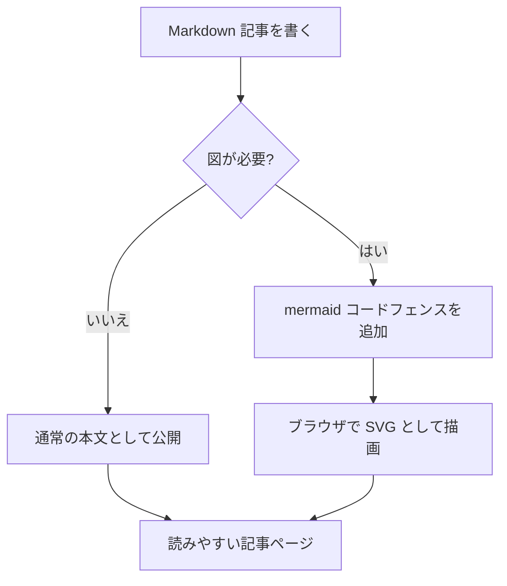

この記事は、このサイトで Markdown を書いたときの見え方を確認するためのサンプルです。本文の行長、段落の余白、コードブロック、表、引用、図の読みやすさをまとめて確認できます。

## 文章の流れ

長い本文では、1 行が長すぎると視線の移動が大きくなります。このサイトでは本文幅を少し絞り、行間を広めに取ることで、PC でもスマートフォンでも読み進めやすい密度にしています。

重要な語句は **強調表示** できます。補足的なファイル名やコマンドは `src/styles/global.css` のようにインラインコードで示します。

## 箇条書き

- まず結論を短く書く。
- 詳細は見出しごとに分ける。
- コードや図は本文の補助として置く。

## 引用

> 読みやすい記事は、装飾を増やすことよりも、情報の優先順位が見えることを大切にします。

## 表

| 要素 | 役割 | 調整方針 |
| --- | --- | --- |
| 見出し | 章の区切り | 余白とサイズ差で階層を作る |
| 段落 | 本文 | 行長と行間を安定させる |
| コード | 実装の例 | 背景色で本文から分ける |
| 図 | 関係性の説明 | 横幅が足りない画面ではスクロールできるようにする |

## コード

```ts
type ArticleSection = {
  title: string;
  summary: string;
};

const section: ArticleSection = {
  title: 'Markdown 表示',
  summary: '本文と図を同じページで読みやすく扱う',
};
```

## Mermaid 図



## まとめ

文章、コード、表、図を同じ記事の中で扱えるようにしておくと、制作ログや技術メモを後から読み返しやすくなります。
